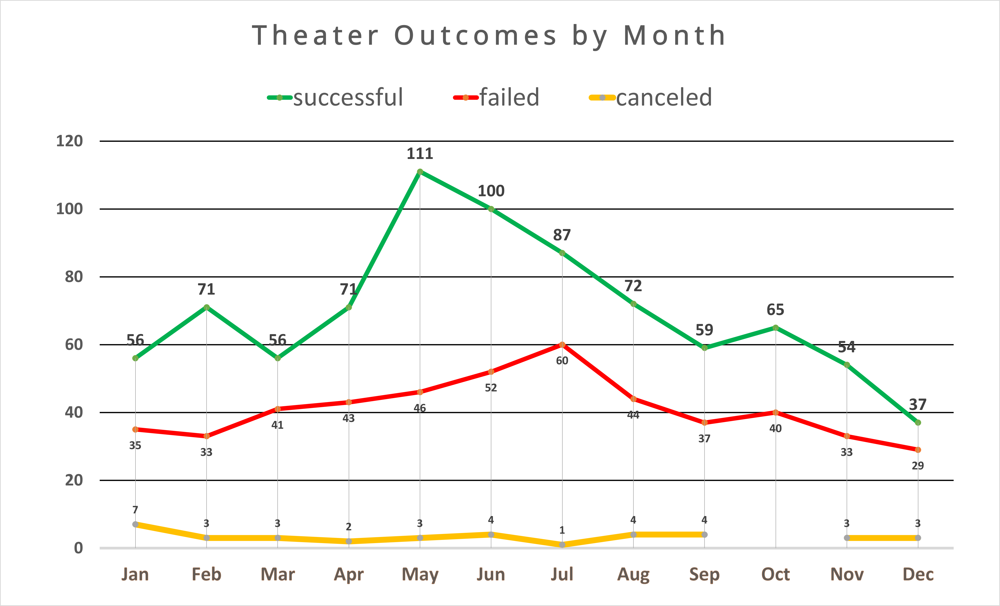
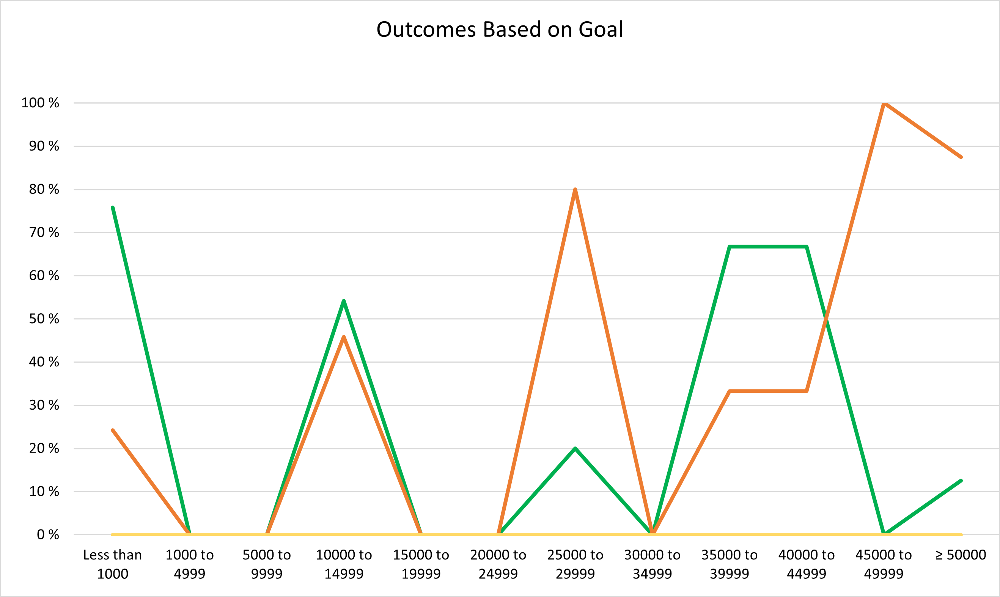

# Optimizing Your Theatrical Kickstarter Campaign
## A Kickstarter Analysis
### Richard E Barber 2021

#### Theater Outcomes Based On Launch Date.

Based on the Kickstarter campaign data for the period under study, this graphical analysis shows there is a definite "theater season" in timing the launch of your Kickstarter campaign. During the May-June period of the year you will have the highest chances of success, compared with other months of the year. The later after May the campaign begins, the higher the project failure rate becomes. 

In this graph, you will find the positive outcomes (green) far outweigh the negatives (red) when the goal was set between $35,000-$45,000. With a budget of around $40,000, you will find your highest chances of acheiving a successful outcome.
